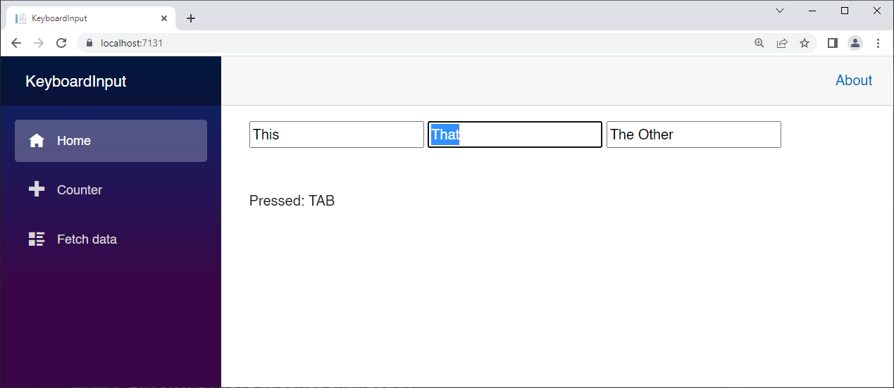
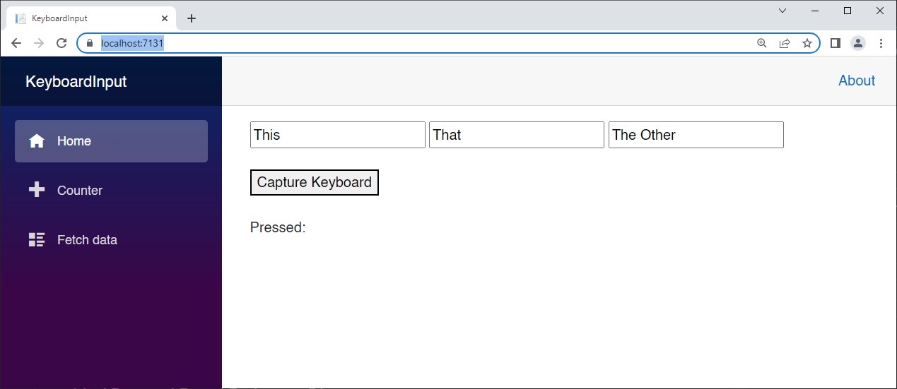
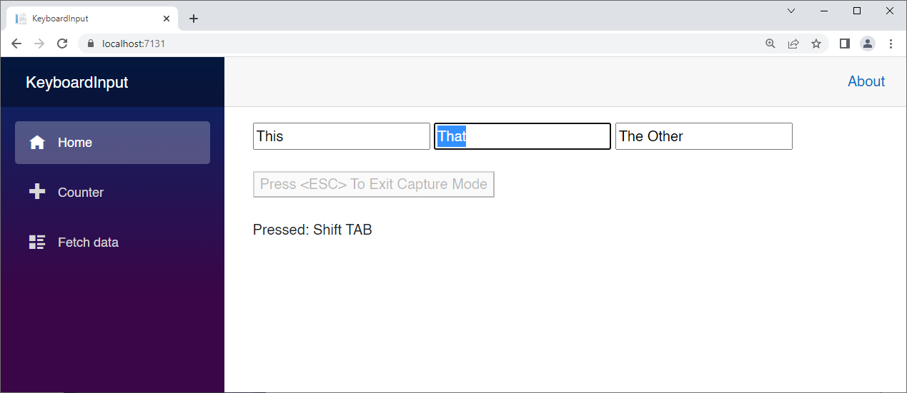
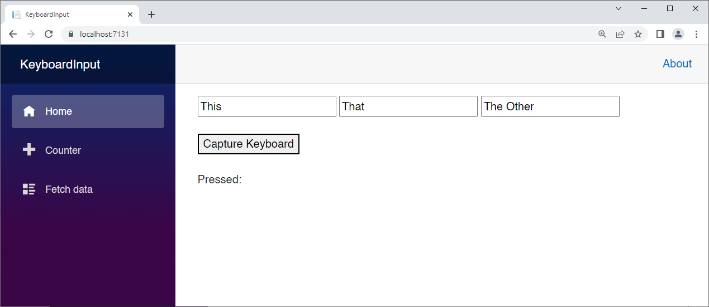
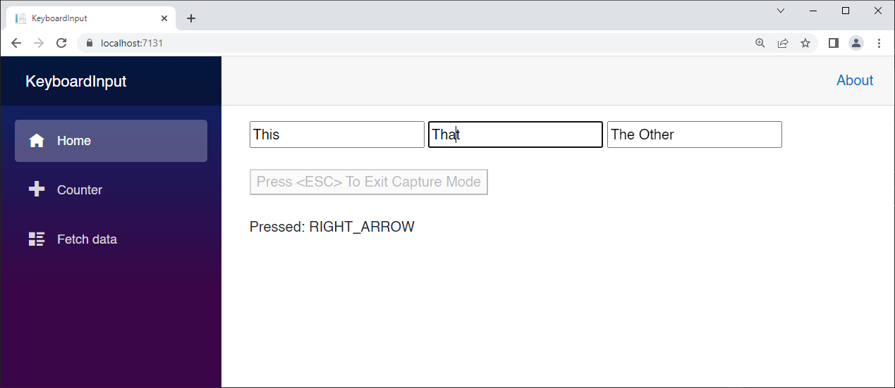

## Controlling Keyboard Input

I’m going to show you how to take complete control of keyboard input in a Blazor application. Sure, you can handle keyboard events in a Blazor component, but you can’t tell Blazor to stop the key from being handled by the browser once you’re done with it. At least in .NET 6, it’s just not possible.  The TAB key is a perfect example of a key we want to control. We’re going to have to resort to a little JavaScript Interop to solve this problem. 

### Create a Blazor WebAssembly project called KeyboardInput

Before we dive in, let's put a few inputs on the screen and test the default behavior.

Replace *Index.razor* with the following:

```html
@page "/"

<div>
    <input id="Input1" value="This" />
    <input id="Input2" value="That" />
    <input id="Input3" value="The Other" />
</div>
```

Run the app (F5)

Press the Tab key repeatedly and observe the behavior.

The browser has control of the Tab key. That's why when you press Tab you are cycling through all of the inputs, then up to the URL bar, over to the right, down the NavMenu, and back to Input1. 

Did you expect to tab from Input3 back to Input1?

I'm going to show you how to capture the Tab key (and all the others) and control what happens when they are pressed.

Add the following `<script>` element and code to *wwwroot/Index.html* just after the line "`<script src="_framework/blazor.webassembly.js"></script>`"

```javascript
<script>

    window.EnableKeyboardCapture = (componentRef) => {

    var shiftPressed = false;
    var altPressed = false;
    var ctrlPressed = false;

    document.onkeydown = function (event) {
        switch (event.keyCode) {
                // Handle Shift, Ctrl, and Alt keys
            case KeyCodes.SHIFT:
                shiftPressed = true;
                break;
            case KeyCodes.CTRL:
                ctrlPressed = true;
                break;
            case KeyCodes.ALT:
                altPressed = true;
                break;

            // Handle keys that we want to swallow
            case KeyCodes.TAB:
            case KeyCodes.UP_ARROW:
            case KeyCodes.DOWN_ARROW:
            case KeyCodes.LEFT_ARROW:
            case KeyCodes.RIGHT_ARROW:
                event.preventDefault();
                event.stopPropagation();
                event.cancelBubble = true;
                componentRef.invokeMethodAsync('WindowKeyDown',
                                               parseInt(event.keyCode.toString()),
                                               shiftPressed, ctrlPressed, altPressed);
                event.returnValue = false;
                break;

                // All other keys
            default:
                componentRef.invokeMethodAsync('WindowKeyDown', parseInt(event.keyCode.toString()), shiftPressed, ctrlPressed, altPressed);
        }
    };

    document.onkeyup = function (event) {
        switch (event.keyCode) {
            case KeyCodes.SHIFT:
                shiftPressed = false;
            case KeyCodes.CTRL:
                ctrlPressed = false;
            case KeyCodes.ALT:
                altPressed = false;
        }
        componentRef.invokeMethodAsync('WindowKeyUp', parseInt(event.keyCode.toString()), shiftPressed, ctrlPressed, altPressed);
    };
}

window.SetFocus = (id) => {
    setTimeout(setFocus, 10, id);
}

function setFocus(id) {
    var inputElem = document.getElementById(id);
    if (inputElem == null) {
        setTimeout(setFocus, 10, id);
        return;
    }
    selectedElementId = id;
    inputElem.focus();
    inputElem.select();
}

var KeyCodes = {
    BACKSPACE: 8,
    TAB: 9,
    ENTER: 13,
    SHIFT: 16,
    CTRL: 17,
    ALT: 18,
    PAUSE: 19,
    CAPS_LOCK: 20,
    ESCAPE: 27,
    SPACE: 32,
    PAGE_UP: 33,
    PAGE_DOWN: 34,
    END: 35,
    HOME: 36,
    LEFT_ARROW: 37,
    UP_ARROW: 38,
    RIGHT_ARROW: 39,
    DOWN_ARROW: 40,
    INSERT: 45,
    DELETE: 46,
    KEY_0: 48,
    KEY_1: 49,
    KEY_2: 50,
    KEY_3: 51,
    KEY_4: 52,
    KEY_5: 53,
    KEY_6: 54,
    KEY_7: 55,
    KEY_8: 56,
    KEY_9: 57,
    KEY_A: 65,
    KEY_B: 66,
    KEY_C: 67,
    KEY_D: 68,
    KEY_E: 69,
    KEY_F: 70,
    KEY_G: 71,
    KEY_H: 72,
    KEY_I: 73,
    KEY_J: 74,
    KEY_K: 75,
    KEY_L: 76,
    KEY_M: 77,
    KEY_N: 78,
    KEY_O: 79,
    KEY_P: 80,
    KEY_Q: 81,
    KEY_R: 82,
    KEY_S: 83,
    KEY_T: 84,
    KEY_U: 85,
    KEY_V: 86,
    KEY_W: 87,
    KEY_X: 88,
    KEY_Y: 89,
    KEY_Z: 90,
    LEFT_META: 91,
    RIGHT_META: 92,
    SELECT: 93,
    NUMPAD_0: 96,
    NUMPAD_1: 97,
    NUMPAD_2: 98,
    NUMPAD_3: 99,
    NUMPAD_4: 100,
    NUMPAD_5: 101,
    NUMPAD_6: 102,
    NUMPAD_7: 103,
    NUMPAD_8: 104,
    NUMPAD_9: 105,
    MULTIPLY: 106,
    ADD: 107,
    SUBTRACT: 109,
    DECIMAL: 110,
    DIVIDE: 111,
    F1: 112,
    F2: 113,
    F3: 114,
    F4: 115,
    F5: 116,
    F6: 117,
    F7: 118,
    F8: 119,
    F9: 120,
    F10: 121,
    F11: 122,
    F12: 123,
    NUM_LOCK: 144,
    SCROLL_LOCK: 145,
    SEMICOLON: 186,
    EQUALS: 187,
    COMMA: 188,
    DASH: 189,
    PERIOD: 190,
    FORWARD_SLASH: 191,
    GRAVE_ACCENT: 192,
    OPEN_BRACKET: 219,
    BACK_SLASH: 220,
    CLOSE_BRACKET: 221,
    SINGLE_QUOTE: 222
};
</script>
```

There's a lot here, so let's start with the `KeyCodes` enumeration.

It simply provides names for the key code numbers. Very helpful.

Check out the `EnableKeyboardCapture` method. We only call this once, when we want to 'turn on' control over the keyboard.

We pass in the component reference so we can call back into C#.

```javascript
window.EnableKeyboardCapture = (componentRef) => {
```

Next I define bool values which I can set depending on the modifier keys (Shift, Alt, and Ctrl)

```javascript
var shiftPressed = false;
var altPressed = false;
var ctrlPressed = false;
```

There are three main keyboard events: `onkeydown`, `onkeyup`, and `onkeypress`. They occur in that order.

Next, we handle the `onkeydown` event, and the first thing we do is set those bool values depending on whether or not they were pressed.

```javascript
document.onkeydown = function (event) {
    var code = parseInt(event.keyCode.toString());
    switch (event.keyCode) {
            // Handle Shift, Ctrl, and Alt keys
        case KeyCodes.SHIFT:
            shiftPressed = true;
            break;
        case KeyCodes.CTRL:
            ctrlPressed = true;
            break;
        case KeyCodes.ALT:
            altPressed = true;
            break;
```

If you jump down to the corollary `onkeyup` handler, you can see that we clear these bool values if need be:

```javascript
document.onkeyup = function (event) {
    switch (event.keyCode) {
        case KeyCodes.SHIFT:
            shiftPressed = false;
        case KeyCodes.CTRL:
            ctrlPressed = false;
        case KeyCodes.ALT:
            altPressed = false;
```

Next, we need to handle all the keys that we want to swallow, or prevent from being passed through to the browser. We can handle them in our code, but the browser will not see them.

```javascript
// Handle keys that we want to swallow
case KeyCodes.TAB:
case KeyCodes.UP_ARROW:
case KeyCodes.DOWN_ARROW:
case KeyCodes.LEFT_ARROW:
case KeyCodes.RIGHT_ARROW:
    event.preventDefault();
    event.stopPropagation();
    event.cancelBubble = true;
    componentRef.invokeMethodAsync('WindowKeyDown',
            parseInt(event.keyCode.toString()),
            shiftPressed, ctrlPressed, altPressed);
    event.returnValue = false;
    break;
```

It seems like overkill, but surely there is a good reason why we need four lines of code (preventDefault, stopPropagation, cancelBubble, and returnValue) in order to truly swallow a key. JavaScript FTW!

Before calling `event.returnValue = false` we are invoking `WindowKeyDown` in the Blazor component. We'll get to that

**SetFocus**

This is a SJT (Stupid JavaScript Trick) that you can use for time travel. OK, it's really for accessing an element even if it doesn't exist yet. 

This is a notoriously common scenario when using a SPA (Single Page Application). You often show an element and then immediately want to access it with JavaScript. The problem is that the element may not be rendered yet. This little workaround does the trick.

```javascript
window.SetFocus = (id) => {
    setTimeout(setFocus, 10, id);
}

function setFocus(id) {
    var inputElem = document.getElementById(id);
    if (inputElem == null) {
        setTimeout(setFocus, 10, id);
        return;
    }
    selectedElementId = id;
    inputElem.focus();
    inputElem.select();
}
```

We call `window.SetFocus` from our Blazor app, passing the id of the element.

That immediately calls our private `setFocus` method after 10 milliseconds using `setTimeout`.

`setFocus` will attempt to get the element reference, but if it can't it calls itself 10 ms later using `setTimeout`.

**KeyCodes in C#**

If we want to handle these key codes in C#, we need a C# enum with the same exact data.

Add the following file to the project:

*Keycodes.cs*:

```c#
public enum KeyCodes
{
    BACKSPACE = 8,
    TAB = 9,
    ENTER = 13,
    SHIFT = 16,
    CTRL = 17,
    ALT = 18,
    PAUSE = 19,
    CAPS_LOCK = 20,
    ESCAPE = 27,
    SPACE = 32,
    PAGE_UP = 33,
    PAGE_DOWN = 34,
    END = 35,
    HOME = 36,
    LEFT_ARROW = 37,
    UP_ARROW = 38,
    RIGHT_ARROW = 39,
    DOWN_ARROW = 40,
    INSERT = 45,
    DELETE = 46,
    KEY_0 = 48,
    KEY_1 = 49,
    KEY_2 = 50,
    KEY_3 = 51,
    KEY_4 = 52,
    KEY_5 = 53,
    KEY_6 = 54,
    KEY_7 = 55,
    KEY_8 = 56,
    KEY_9 = 57,
    KEY_A = 65,
    KEY_B = 66,
    KEY_C = 67,
    KEY_D = 68,
    KEY_E = 69,
    KEY_F = 70,
    KEY_G = 71,
    KEY_H = 72,
    KEY_I = 73,
    KEY_J = 74,
    KEY_K = 75,
    KEY_L = 76,
    KEY_M = 77,
    KEY_N = 78,
    KEY_O = 79,
    KEY_P = 80,
    KEY_Q = 81,
    KEY_R = 82,
    KEY_S = 83,
    KEY_T = 84,
    KEY_U = 85,
    KEY_V = 86,
    KEY_W = 87,
    KEY_X = 88,
    KEY_Y = 89,
    KEY_Z = 90,
    LEFT_META = 91,
    RIGHT_META = 92,
    SELECT = 93,
    NUMPAD_0 = 96,
    NUMPAD_1 = 97,
    NUMPAD_2 = 98,
    NUMPAD_3 = 99,
    NUMPAD_4 = 100,
    NUMPAD_5 = 101,
    NUMPAD_6 = 102,
    NUMPAD_7 = 103,
    NUMPAD_8 = 104,
    NUMPAD_9 = 105,
    MULTIPLY = 106,
    ADD = 107,
    SUBTRACT = 109,
    DECIMAL = 110,
    DIVIDE = 111,
    F1 = 112,
    F2 = 113,
    F3 = 114,
    F4 = 115,
    F5 = 116,
    F6 = 117,
    F7 = 118,
    F8 = 119,
    F9 = 120,
    F10 = 121,
    F11 = 122,
    F12 = 123,
    NUM_LOCK = 144,
    SCROLL_LOCK = 145,
    SEMICOLON = 186,
    EQUALS = 187,
    COMMA = 188,
    DASH = 189,
    PERIOD = 190,
    FORWARD_SLASH = 191,
    GRAVE_ACCENT = 192,
    OPEN_BRACKET = 219,
    BACK_SLASH = 220,
    CLOSE_BRACKET = 221,
    SINGLE_QUOTE = 222
}
```

Now we can modify our *Index.razor* page to capture the keystrokes and act accordingly:

```c#
@page "/"
@inject IJSRuntime JSRuntime

<div>
    <input id="Input1" @onclick="() => SetInputIndex(0)" value="This" />
    <input id="Input2" @onclick="() => SetInputIndex(1)" value="That" />
    <input id="Input3" @onclick="() => SetInputIndex(2)" value="The Other" />
</div>
<br />
<br />
Pressed: @KeyPressed

@code
{
    int CurrentInputIndex = -1;
    string[] InputIds = new string[] { "Input1", "Input2", "Input3" };
    string KeyPressed = "";

    async Task SetInputIndex(int index)
    {
        CurrentInputIndex = index;
    }

    [JSInvokable]
    public async Task WindowKeyDown(KeyCodes KeyCode, bool Shift, bool Ctrl, bool Alt)
    {
        KeyPressed = "";
        if (Shift)
            KeyPressed += "Shift ";
        if (Ctrl)
            KeyPressed += "Ctrl ";
        if (Alt)
            KeyPressed += "Alt ";
        KeyPressed += Enum.GetName(typeof(KeyCodes), KeyCode);

        if (KeyCode == KeyCodes.TAB)
        {
            if (Shift)
                await MovePrevious();
            else
                await MoveNext();
        }
        else if (KeyCode == KeyCodes.RIGHT_ARROW)
        {
            await MoveNext();
        }
        else if (KeyCode == KeyCodes.DOWN_ARROW)
        {
            await MoveNext();
        }
        else if (KeyCode == KeyCodes.LEFT_ARROW)
        {
            await MovePrevious();
        }
        else if (KeyCode == KeyCodes.UP_ARROW)
        {
            await MovePrevious();
        }
    }

    [JSInvokable]
    public async Task WindowKeyUp(KeyCodes KeyCode, bool Shift, bool Ctrl, bool Alt)
    {
        await InvokeAsync(StateHasChanged);
    }

    async Task MoveNext()
    {
        if (CurrentInputIndex < InputIds.Length - 1)
            CurrentInputIndex++;
        else CurrentInputIndex = 0;
        await JSRuntime.InvokeVoidAsync("SetFocus", InputIds[CurrentInputIndex]);
    }

    async Task MovePrevious()
    {
        if (CurrentInputIndex > 0)
            CurrentInputIndex--;
        else CurrentInputIndex = InputIds.Length - 1;
        await JSRuntime.InvokeVoidAsync("SetFocus", InputIds[CurrentInputIndex]);
    }

    protected override async Task OnAfterRenderAsync(bool firstRender)
    {
        if (firstRender)
        {
            await JSRuntime.InvokeVoidAsync("EnableKeyboardCapture", 
				DotNetObjectReference.Create(this));
        }
    }
}
```

Let's start at the bottom. We're handling `OnAfterRenderAsync`. If it's the first render, we make the call into JavaScript to enable keyboard capture, passing a new DotNetObjectReference we create from the page component.

```c#
protected override async Task OnAfterRenderAsync(bool firstRender)
{
    if (firstRender)
    {
        await JSRuntime.InvokeVoidAsync("EnableKeyboardCapture", 
        	DotNetObjectReference.Create(this));
    }
}
```

I'm keeping the ids of the inputs in an array:

```c#
int CurrentInputIndex = -1;
string[] InputIds = new string[] { "Input1", "Input2", "Input3" };
```

That way, when I TAB from input to input, I can just change `CurrentInputIndex` .

The `SetInputIndex` method is called from the inputs when clicked:

```c#
async Task SetInputIndex(int index)
{
    CurrentInputIndex = index;
}
```

```html
<input id="Input1" @onclick="() => SetInputIndex(0)" value="This" />
<input id="Input2" @onclick="() => SetInputIndex(1)" value="That" />
<input id="Input3" @onclick="() => SetInputIndex(2)" value="The Other" />
```

Note that I'm showing the key that was last pressed in the UI:

```c#
string KeyPressed = "";
```

```html
Pressed: @KeyPressed
```

Now let's look at the `WindowKeyDown` method, which is called from JavaScript:

```c#
[JSInvokable]
public async Task WindowKeyDown(KeyCodes KeyCode, bool Shift, bool Ctrl, bool Alt)
{
    KeyPressed = "";
    if (Shift)
        KeyPressed += "Shift ";
    if (Ctrl)
        KeyPressed += "Ctrl ";
    if (Alt)
        KeyPressed += "Alt ";
    
    KeyPressed += Enum.GetName(typeof(KeyCodes), KeyCode);

    if (KeyCode == KeyCodes.TAB)
    {
        if (Shift)
            await MovePrevious();
        else
            await MoveNext();
    }
    else if (KeyCode == KeyCodes.RIGHT_ARROW)
    {
        await MoveNext();
    }
    else if (KeyCode == KeyCodes.DOWN_ARROW)
    {
        await MoveNext();
    }
    else if (KeyCode == KeyCodes.LEFT_ARROW)
    {
        await MovePrevious();
    }
    else if (KeyCode == KeyCodes.UP_ARROW)
    {
        await MovePrevious();
    }
}
```

The logic is easy to follow. If Tab, Right-Arrow, or Down-Arrow are pressed, we move to the next field. If Shift-Tab, Left-Arrow, or Up-Arrow are pressed, we move to the previous field. We're leaving it up to these methods to figure out if we need to wrap around or not:

```c#
async Task MoveNext()
{
    if (CurrentInputIndex < InputIds.Length - 1)
        CurrentInputIndex++;
    else CurrentInputIndex = 0;
    await JSRuntime.InvokeVoidAsync("SetFocus", InputIds[CurrentInputIndex]);
}

async Task MovePrevious()
{
    if (CurrentInputIndex > 0)
        CurrentInputIndex--;
    else CurrentInputIndex = InputIds.Length - 1;
    await JSRuntime.InvokeVoidAsync("SetFocus", InputIds[CurrentInputIndex]);
}
```

When a key is released, the `WindowKeyUp` event is called. All we're doing here is re-rendering the page:

```c#
[JSInvokable]
public async Task WindowKeyUp(KeyCodes KeyCode, bool Shift, bool Ctrl, bool Alt)
{
    await InvokeAsync(StateHasChanged);
}
```

Run the App (F5)

Try using the Tab and Arrow keys with and without the Shift key.



### Turning Keyboard Capture On and Off

Now we're going to take this one step further by allowing the user to turn capture on and off. 

Add the following function to the top of the `<script>` tag in *wwwroot/index.html*:

```javascript
window.DisableKeyboardCapture = () => {
    document.onkeydown = null;
    document.onkeyup = null;
}
```

This will effectively disable our capture event handlers if they exist.

Replace *Index.razor* with the following:

```c#
@page "/"
@inject IJSRuntime JSRuntime

<div>
    <input id="Input1" @onclick="() => SetInputIndex(0)" value="This" />
    <input id="Input2" @onclick="() => SetInputIndex(1)" value="That" />
    <input id="Input3" @onclick="() => SetInputIndex(2)" value="The Other" />
</div>
<br />
<button disabled="@CaptureButtonDisabled" @onclick="EnableKeyboardCapture">@CaptureButtonText</button>
<br />
<br />
Pressed: @KeyPressed

@code
{
    int CurrentInputIndex = -1;
    string[] InputIds = new string[] { "Input1", "Input2", "Input3" };
    string KeyPressed = "";
    string CaptureButtonText = "Capture Keyboard";
    DotNetObjectReference<Index> ThisComponent;
    bool CaptureButtonDisabled { get; set; }

    async Task EnableKeyboardCapture()
    {
        await JSRuntime.InvokeVoidAsync("EnableKeyboardCapture", ThisComponent);
        CaptureButtonText = "Press <ESC> To Exit Capture Mode";
        CaptureButtonDisabled = true;
        await InvokeAsync(StateHasChanged);
    }

    async Task SetInputIndex(int index)
    {
        if (CurrentInputIndex != index)
        {
            CurrentInputIndex = index;
            await JSRuntime.InvokeVoidAsync("SetFocus", InputIds[CurrentInputIndex]);
        }
    }

    [JSInvokable]
    public async Task WindowKeyDown(KeyCodes KeyCode, bool Shift, bool Ctrl, bool Alt)
    {
        KeyPressed = "";
        if (Shift)
            KeyPressed += "Shift ";
        if (Ctrl)
            KeyPressed += "Ctrl ";
        if (Alt)
            KeyPressed += "Alt ";
        KeyPressed += Enum.GetName(typeof(KeyCodes), KeyCode);

        if (KeyCode == KeyCodes.TAB)
        {
            if (Shift)
                await MovePrevious();
            else
                await MoveNext();
        }
        else if (KeyCode == KeyCodes.RIGHT_ARROW)
        {
            await MoveNext();
        }
        else if (KeyCode == KeyCodes.DOWN_ARROW)
        {
            await MoveNext();
        }
        else if (KeyCode == KeyCodes.LEFT_ARROW)
        {
            await MovePrevious();
        }
        else if (KeyCode == KeyCodes.UP_ARROW)
        {
            await MovePrevious();
        }
        else if (KeyCode == KeyCodes.ESCAPE)
        {
            await JSRuntime.InvokeVoidAsync("DisableKeyboardCapture");
            CaptureButtonDisabled = false;
            CaptureButtonText = "Capture Keyboard";
            await InvokeAsync(StateHasChanged);
        }
    }

    [JSInvokable]
    public async Task WindowKeyUp(KeyCodes KeyCode, bool Shift, bool Ctrl, bool Alt)
    {
        await InvokeAsync(StateHasChanged);
    }

    async Task MoveNext()
    {
        if (CurrentInputIndex < InputIds.Length - 1)
            CurrentInputIndex++;
        else CurrentInputIndex = 0;
        await JSRuntime.InvokeVoidAsync("SetFocus", InputIds[CurrentInputIndex]);
    }

    async Task MovePrevious()
    {
        if (CurrentInputIndex > 0)
            CurrentInputIndex--;
        else CurrentInputIndex = InputIds.Length - 1;
        await JSRuntime.InvokeVoidAsync("SetFocus", InputIds[CurrentInputIndex]);
    }

    protected override void OnAfterRender(bool firstRender)
    {
        if (firstRender)
        {
            ThisComponent = DotNetObjectReference.Create(this);
        }
    }
}
```

Now we have a button to enable keyboard capture:

```html
<button disabled="@CaptureButtonDisabled" 
	@onclick="EnableKeyboardCapture">@CaptureButtonText</button>
```

We are using two new variables:

```c#
bool CaptureButtonDisabled { get; set; }
```

and

```c#
string CaptureButtonText = "Capture Keyboard";
```

They are variables because they can change.

Check out `EnableKeyboardCapture`:

```c#
async Task EnableKeyboardCapture()
{
    await JSRuntime.InvokeVoidAsync("EnableKeyboardCapture", ThisComponent);
    CaptureButtonText = "Press <ESC> To Exit Capture Mode";
    CaptureButtonDisabled = true;
    await InvokeAsync(StateHasChanged);
}
```

The very first line calls our JavaScript but it passes `ThisComponent`, a module-level variable:

```c#
DotNetObjectReference<Index> ThisComponent;
```

We create this in `OnAfterRender`:

```c#
protected override void OnAfterRender(bool firstRender)
{
    if (firstRender)
    {
        ThisComponent = DotNetObjectReference.Create(this);
    }
}
```

Getting back to `EnableKeyboardCapture`, the rest of the code changes the button text and disables the button:

```c#
    CaptureButtonText = "Press <ESC> To Exit Capture Mode";
    CaptureButtonDisabled = true;
    await InvokeAsync(StateHasChanged);
```

When we press this button, the keyboard capture is enabled, the button becomes disabled, and the text tells us to press the Escape key to exit capture mode.

So, we have to handle the Escape key. That's done in `WindowKeyDown`:

```c#
[JSInvokable]
public async Task WindowKeyDown(KeyCodes KeyCode, bool Shift, bool Ctrl, bool Alt)
{
    KeyPressed = "";
    if (Shift)
        KeyPressed += "Shift ";
    if (Ctrl)
        KeyPressed += "Ctrl ";
    if (Alt)
        KeyPressed += "Alt ";

    KeyPressed += Enum.GetName(typeof(KeyCodes), KeyCode);

    if (KeyCode == KeyCodes.TAB)
    {
        if (Shift)
            await MovePrevious();
        else
            await MoveNext();
    }
    else if (KeyCode == KeyCodes.RIGHT_ARROW)
    {
        await MoveNext();
    }
    else if (KeyCode == KeyCodes.DOWN_ARROW)
    {
        await MoveNext();
    }
    else if (KeyCode == KeyCodes.LEFT_ARROW)
    {
        await MovePrevious();
    }
    else if (KeyCode == KeyCodes.UP_ARROW)
    {
        await MovePrevious();
    }
    else if (KeyCode == KeyCodes.ESCAPE)
    {
        await JSRuntime.InvokeVoidAsync("DisableKeyboardCapture");
        CaptureButtonDisabled = false;
        CaptureButtonText = "Capture Keyboard";
        await InvokeAsync(StateHasChanged);
    }
}
```

The only change we made is right at the bottom where we handle the Escape key.

We call the JavaScript function `DisableKeyboardCapture`

We re-enable the button, and we set the text to "Capture Keyboard".

Run the App (F5) and experiment with enabling and disabling capture mode.



Enable capture



Experiment with the Tab and Arrow keys.

When you're done, press the Escape key and you're back where you were.


### Navigation Ruins Everything

Run the App (F5), enable capture, Tab around, and then navigate to the **Counter** page and back.

This is what you see:



Now it looks like you're NOT in capture mode. But, if you press Tab you'll see that you are indeed in capture mode. Pressing the button to enable capture would be redundant and ultimately cause problems.

This is an invalid UI state, and we must fix it.

**Use the NavigationManager**

Add this to the top of the page (after line 2):

```c#
@inject NavigationManager NavagationManager
```

Add a `LocationChanged` event handler in the `@code` block:

```c#
async void LocationChanged(object sender, LocationChangedEventArgs e)
{
	await JSRuntime.InvokeVoidAsync("DisableKeyboardCapture");
}
```

Now, in the OnAfterRender override, hook the event:

```c#
protected override void OnAfterRender(bool firstRender)
{
    if (firstRender)
    {
        ThisComponent = DotNetObjectReference.Create(this);
        NavagationManager.LocationChanged += LocationChanged;
    }
}
```

This will effectively disable the capture mode if we navigate away from this page.

Run the App (F5) and try the experiment again.

Enable capture, navigate to Counter and back, and then see whether capture is disabled.

Works on my machine. :)

#### Enable Arrow Keys for Editing when in Capture Mode

As it is now, when capturing keyboard input, we can't use the arrow keys in the inputs themselves to move the caret position between letters. Let's fix that.

While we're at it, we'll allow moving to the next field if we press the Right-Arrow when at the end of the text, or to the previous field if we press the Left-Arrow while at the beginning of the text.

Replace all of the JavaScript code from the top of the `<script>` tag to the definition of `keyCodes` with this:

```javascript
var selectedElementId = "";

function GetElementCaretPosition() {
    var result = -1;
    var elem = document.getElementById(selectedElementId);
    if (elem != null) {
        var startPosition = elem.selectionStart;
        var endPosition = elem.selectionEnd;
        if (startPosition == endPosition) {
            if (startPosition == elem.value.length)
                result = 1;
            else if (startPosition == 0) {
                result = 0;
            }
        }
    }
    return result;
}

window.DisableKeyboardCapture = () => {
    document.onkeydown = null;
    document.onkeyup = null;
}

window.EnableKeyboardCapture = (componentRef) => {

    var shiftPressed = false;
    var altPressed = false;
    var ctrlPressed = false;

    document.onkeydown = function (event) {
        var code = parseInt(event.keyCode.toString());
        switch (event.keyCode) {
                // Handle Shift, Ctrl, and Alt keys
            case KeyCodes.SHIFT:
                shiftPressed = true;
                break;
            case KeyCodes.CTRL:
                ctrlPressed = true;
                break;
            case KeyCodes.ALT:
                altPressed = true;
                break;

            // Handle keys that we want to swallow
            case KeyCodes.TAB:
                raiseKeyDownEvent(code);
                break;
            case KeyCodes.UP_ARROW:
                if (GetElementCaretPosition() == 0)
                    raiseKeyDownEvent(code);
                break;
            case KeyCodes.DOWN_ARROW:
                if (GetElementCaretPosition() == 1)
                    raiseKeyDownEvent(code);
                break;
            case KeyCodes.LEFT_ARROW:
                if (GetElementCaretPosition() == 0)
                    raiseKeyDownEvent(code);
                break;
            case KeyCodes.RIGHT_ARROW:
                if (GetElementCaretPosition() == 1)
                    raiseKeyDownEvent(code);
                break;

                // All other keys
            default:
                componentRef.invokeMethodAsync('WindowKeyDown', 
					parseInt(event.keyCode.toString()), shiftPressed, ctrlPressed,
					altPressed);
        }
    };

    function raiseKeyDownEvent(keyCode) {
        event.preventDefault();
        event.stopPropagation();
        event.cancelBubble = true;
        componentRef.invokeMethodAsync('WindowKeyDown', keyCode, shiftPressed,
			ctrlPressed, altPressed);
        event.returnValue = false;
    }

    document.onkeyup = function (event) {
        switch (event.keyCode) {
            case KeyCodes.SHIFT:
                shiftPressed = false;
            case KeyCodes.CTRL:
                ctrlPressed = false;
            case KeyCodes.ALT:
                altPressed = false;
        }
        componentRef.invokeMethodAsync('WindowKeyUp', parseInt(event.keyCode.toString()),
			shiftPressed, ctrlPressed, altPressed);
    };
}

window.SetFocus = (id) => {
    setTimeout(setFocus, 10, id);
}

function setFocus(id) {
    var inputElem = document.getElementById(id);
    if (inputElem == null) {
        setTimeout(setFocus, 10, id);
        return;
    }
    selectedElementId = id;
    inputElem.focus();
    inputElem.select();
}
```

I've introduced a new variable:

```javascript
var selectedElementId = "";
```

and in our private `setFocus` function, I'm setting this value (see above).

I've also added a new private function, `GetElementCaretPosition`

```javascript
function GetElementCaretPosition() {
    var result = -1;
    var elem = document.getElementById(selectedElementId);
    if (elem != null) {
        var startPosition = elem.selectionStart;
        var endPosition = elem.selectionEnd;
        if (startPosition == endPosition) {
            if (startPosition == elem.value.length)
                result = 1;
            else if (startPosition == 0) {
                result = 0;
            }
        }
    }
    return result;
}
```

This function returns 0 if the caret position is at the start of the text, 1 if it's at the end, and -1 if the caret position is somewhere in the middle.

This will help us determine whether or not to report the Arrow keys to the Blazor Component.

Because I need to call it from multiple places, I've extracted the code that blocks the keys to a new function:

```c#
function raiseKeyDownEvent(keyCode) {
    event.preventDefault();
    event.stopPropagation();
    event.cancelBubble = true;
    componentRef.invokeMethodAsync('WindowKeyDown', keyCode, shiftPressed,
                                   ctrlPressed, altPressed);
    event.returnValue = false;
}
```

Now in the `onkeydown` handler, when an arrow key is pressed, we only handle it if the caret position is not inside the text, otherwise we just let it through:

```javascript
// Handle keys that we want to swallow
case KeyCodes.TAB:
    raiseKeyDownEvent(code);
    break;
case KeyCodes.UP_ARROW:
    if (GetElementCaretPosition() == 0)
        raiseKeyDownEvent(code);
    break;
case KeyCodes.DOWN_ARROW:
    if (GetElementCaretPosition() == 1)
        raiseKeyDownEvent(code);
    break;
case KeyCodes.LEFT_ARROW:
    if (GetElementCaretPosition() == 0)
        raiseKeyDownEvent(code);
    break;
case KeyCodes.RIGHT_ARROW:
    if (GetElementCaretPosition() == 1)
        raiseKeyDownEvent(code);
    break;
```

Back in *Index.razor*, we need to call `SetFocus` (JavaScript) when the user clicks on an element. That's where the `selectedElementId` is set, which makes this whole thing work.

Replace `SetInputIndex` with this:

```c#
async Task SetInputIndex(int index)
{
    if (CurrentInputIndex != index)
    {
        CurrentInputIndex = index;
        await JSRuntime.InvokeVoidAsync("SetFocus", InputIds[CurrentInputIndex]);
    }
}
```

Run the App (F5) and experiment with the arrow keys.



## 